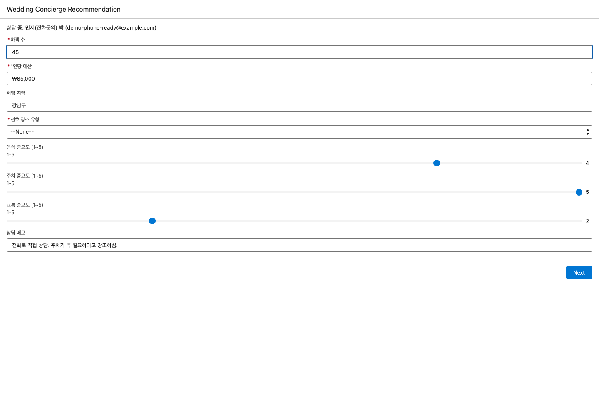
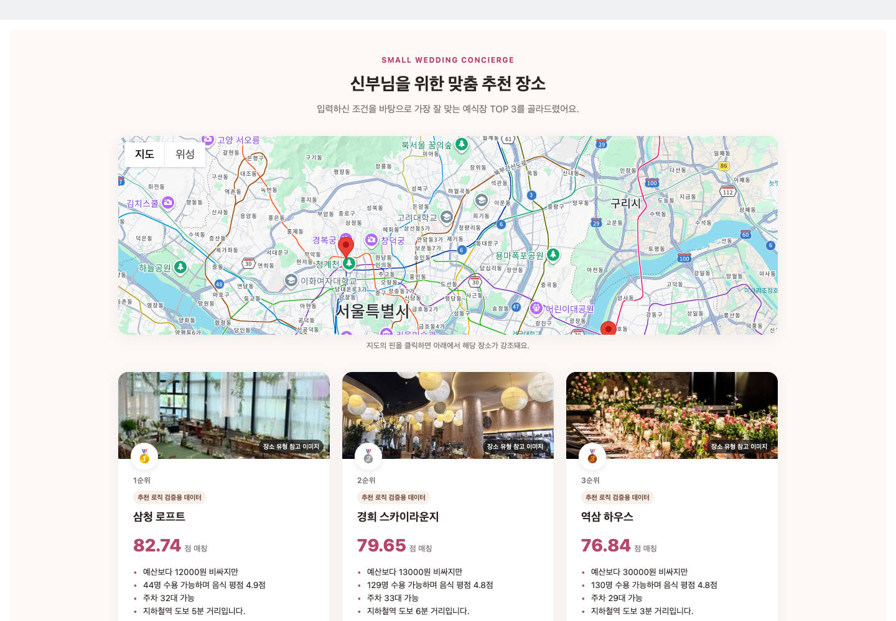
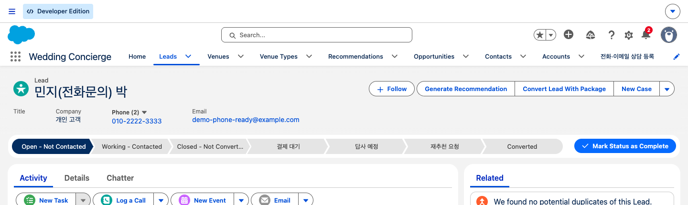
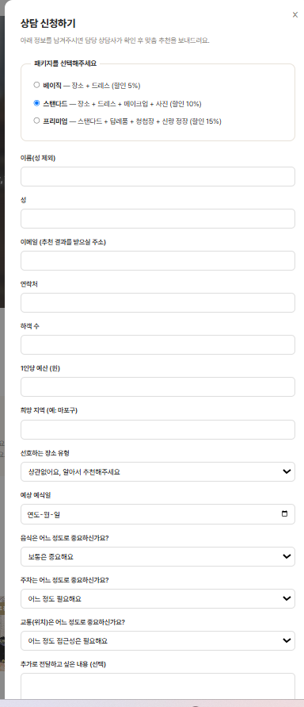
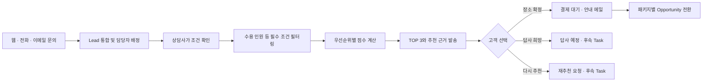

# Small Wedding Concierge CRM

웹·전화·이메일로 흩어진 스몰웨딩 상담을 Salesforce Lead로 통합하고, 상담사가 확인한 고객 조건을 바탕으로 장소 TOP 3와 추천 근거를 생성하는 CRM입니다. 고객이 공개 추천 페이지에서 답사·확정·재추천을 선택하면 상담 단계와 후속 업무가 갱신되고, 장소 확정 후에는 웨딩 Opportunity로 전환됩니다.

개인 프로젝트로 문제 정의, 데이터 모델, Flow, Apex, LWC, Experience Cloud, Web-to-Lead를 설계하고 구현했습니다. 실제 서비스 운영 성과를 주장하는 프로젝트가 아니라, 상담 업무를 끝까지 연결한 Salesforce 프로토타입입니다.

| 문의 채널 | 장소 데이터 | 1차 조건 통과 | 최종 추천 |
|---:|---:|---:|---:|
| 3개 | 160건 | 61건 | TOP 3 |

> 장소 데이터는 공식 페이지를 참고해 정리한 100건과 추천 로직 검증용 합성 데이터 60건으로 구성했습니다. 가격·평점처럼 검증이 끝나지 않은 값은 실제 운영 데이터로 간주하지 않습니다.

## 사용자가 경험하는 흐름

| 상담 조건을 구조화하는 Screen Flow | 고객에게 전달되는 추천 결과 |
|---|---|
|  |  |

| 한 화면에서 이어지는 상담 단계와 실행 | 고객이 처음 접하는 문의 화면 |
|---|---|
|  |  |

## 해결하려던 문제

직장인 예비부부는 평일에 여러 장소를 직접 비교하기 어렵고, 40명 안팎의 하객을 고려해 음식·주차·교통·예산을 동시에 판단해야 합니다. 상담사 역시 웹·전화·이메일로 들어오는 문의와 여러 고객의 조건을 각각 관리하면서 매번 후보 장소를 수기로 대조해야 합니다.

그래서 장소 정보를 많이 보여주는 검색 화면보다 다음 두 가지에 집중했습니다.

- 상담사의 판단 기준을 데이터로 남겨 같은 과정을 반복할 수 있게 한다.
- 고객의 선택을 다시 CRM 업무로 연결해 다음 행동이 누락되지 않게 한다.



접수는 자동화하되 추천 실행 전에는 상담사가 조건을 확인하도록 했습니다. Web-to-Lead의 입력을 그대로 신뢰하기보다 상담사가 고객과 대화하며 정정한 값을 추천 기준으로 사용하기 위해서입니다.

## 개발 범위와 설계 판단

| 영역 | 구현 | 설계 이유 |
|---|---|---|
| 문의 통합 | Web-to-Lead, 전화·이메일 등록 Flow, Assignment Rule | 서로 다른 채널을 하나의 Lead 파이프라인으로 관리 |
| 상담 조건 | Lead 커스텀 필드와 Screen Flow | 하객 수·예산·지역·장소 유형·음식/주차/교통 중요도를 상담사가 확인 |
| 추천 | Flow의 조건 필터, 가중 점수, Collection Sort, TOP 3 생성 | 관리자가 기준을 확인할 수 있게 선언형 로직으로 구성 |
| 고객 페이지 | Experience Cloud + LWC | Salesforce 계정이 없는 고객도 지도·점수·추천 근거를 확인하고 응답 |
| 공개 접근 제어 | Apex 토큰 발급 및 검증 | 레코드 ID를 URL에 노출하지 않고 해당 상담 건의 데이터만 반환 |
| 후속 업무 | Lead 상태 변경, Task 생성, 결제 안내 이메일 | 고객의 선택을 상담사의 다음 행동으로 전환 |
| 계약 전환 | Apex Lead Convert + 패키지별 Record Type | Basic·Standard·Concierge 패키지에 맞는 Opportunity 단계로 시작 |

Flow에는 상담사가 변경할 가능성이 큰 추천 기준과 화면 흐름을 두었습니다. Guest User의 데이터 접근 검증, Lead Convert처럼 권한과 트랜잭션 제어가 필요한 작업은 Apex가 담당합니다. 고객에게 보이는 상호작용과 지도는 LWC로 구현했습니다.

## 개인화 점수

먼저 수용 인원과 운영 조건을 만족하는 장소만 후보에 남깁니다. 이후 음식·주차·교통 점수를 고객이 정한 중요도 1~5로 가중하고, 예산 적합도에는 고정 가중치 5를 적용합니다.

```text
개인화 점수 =
  (음식 점수 × 음식 중요도
 + 주차 점수 × 주차 중요도
 + 교통 점수 × 교통 중요도
 + 예산 적합도 × 5)
 ÷ (음식 중요도 + 주차 중요도 + 교통 중요도 + 5)
```

결과는 0~100 범위로 정규화됩니다. 같은 장소라도 고객이 중요하게 보는 조건에 따라 순위가 달라지며, 계산에 사용한 수용 인원·가격·평점·주차 정보를 추천 근거 문장으로 함께 저장합니다. 장소 정보가 나중에 바뀌어도 당시 결과를 설명할 수 있도록 장소명과 점수를 Recommendation에 스냅샷으로 남깁니다.

## 구현하면서 해결한 문제

### 추천 재실행 시 결과가 계속 쌓이던 문제

상담사가 조건을 바꾸어 Flow를 다시 실행하면 추천이 3개에서 6개, 9개로 누적됐습니다. 실행 전에 해당 Lead의 기존 Recommendation을 정리하도록 바꿨습니다. Salesforce의 Delete Records는 삭제할 레코드가 0개일 때도 fault가 발생했기 때문에, 첫 실행은 정상 경로로 계속 진행하도록 fault connector를 구성했습니다.

### Lead 전환 후 잘못된 영업 단계가 적용되던 문제

Lead Convert 결과가 웨딩 단계인 `장소 확정` 대신 전역 기본값인 `Prospecting`으로 생성됐습니다. 패키지에 맞는 Opportunity Record Type을 결정하는 Apex와 웨딩 Record Type의 초기 단계를 보정하는 Before-Save Flow를 함께 적용했습니다.

### 공개 페이지의 조회 범위 제한

Experience Cloud Guest User는 Salesforce 로그인 없이 페이지에 접근합니다. 32자 난수 토큰을 발급하고 7일 만료 시각을 함께 저장하며, Apex는 유효한 토큰에 연결된 Lead와 Recommendation만 조회합니다. 장소 확정 요청도 Recommendation의 `Lead__c`가 토큰의 Lead와 일치할 때만 처리합니다.

### 데모 데이터와 참고 이미지 표시

추천 로직 검증용 장소는 고객 화면에 배지를 표시합니다. 카드 이미지는 실제 장소 사진으로 오해하지 않도록 `장소 유형 참고 이미지`라고 명시했습니다.

## 검증

2026-09-10 전용 Developer Edition org에 보안 변경을 배포하고 핵심 Apex 테스트를 실행했습니다.

| 검증 항목 | 결과 |
|---|---:|
| Apex 테스트 메서드 | 10/10 통과 |
| 핵심 클래스 3개 통합 커버리지 | 88% |
| `AccessTokenService` | 100% |
| `LeadConversionService` | 93% |
| `VenuePublicController` | 83% |

추가로 웹·전화·이메일 문의가 Lead로 연결되는 흐름, Screen Flow 재실행 후 추천이 정확히 3개만 남는지, 추천 이메일의 Activity 기록, 패키지별 Lead Convert를 브라우저에서 확인했습니다. 이번 보안 보강에는 만료 토큰 거부와 다른 Lead의 추천 선택 거부 테스트를 추가했습니다.

## 저장소 구성

```text
force-app/main/default/
├── classes/              # 공개 페이지 접근과 Lead Convert Apex 및 테스트
├── flows/                # 상담 등록, 추천, 전환, 초기 단계 자동화
├── lwc/                  # 고객용 추천 지도와 선택 UI
├── objects/              # Lead, Venue, Recommendation, Opportunity 모델
├── digitalExperiences/   # 고객용 Experience Cloud 페이지
├── email/                # 결제 안내 템플릿
└── staticresources/      # 장소 유형 참고 이미지
web-to-lead/              # 공개 상담 신청 페이지
docs/                     # 기획안과 상세 설계 기록
```

처음에는 AFDX Agentforce Testdrive 템플릿 org에서 개발했고 이후 전용 Developer Edition org로 옮겼습니다. 저장소에는 직접 만든 CRM 컴포넌트와 실행에 필요한 사이트·이미지 메타데이터를 담았습니다. org에는 템플릿 샘플 데이터 일부가 남아 있으므로, 이 저장소의 수치와 검증은 웨딩 컨시어지 컴포넌트만을 대상으로 합니다.

- [상세 설계와 트러블슈팅](./docs/설계문서.md)
- [기획안 PDF](./docs/스몰웨딩_컨시어지_CRM_기획안.pdf)
- [기여 범위](./CONTRIBUTIONS.md)
