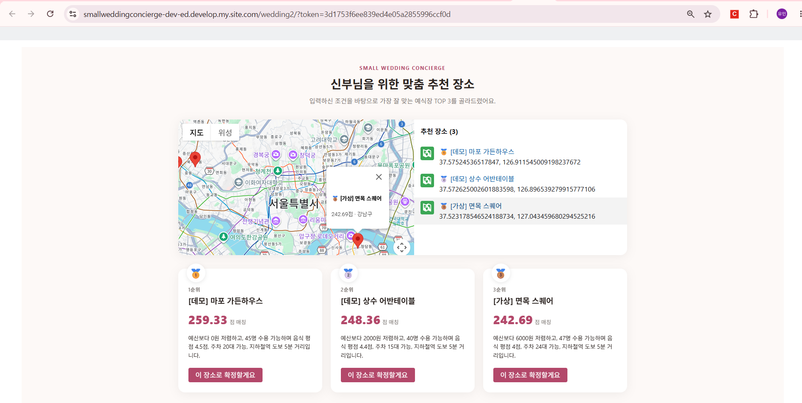
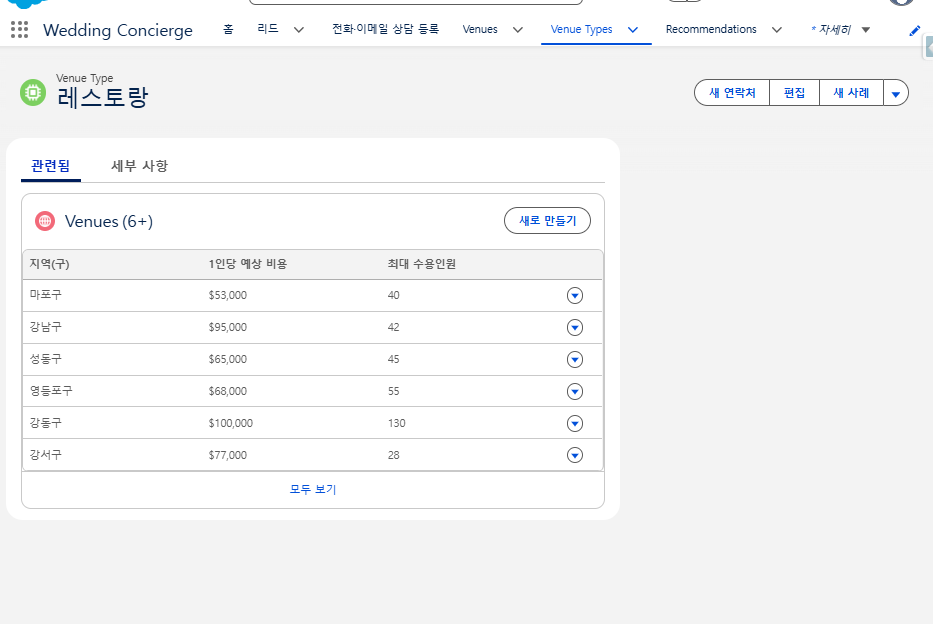

# Small Wedding Concierge CRM

> 스몰웨딩(40명 규모) 식당·장소를 전문으로 추천·상담하는 컨시어지 업체를 위한 Salesforce CRM.
> **개인 프로젝트** — 문제 정의부터 데이터 모델·자동화·공개 웹폼까지 단독 설계·구축.
> Salesforce **AFDX Agentforce Testdrive** 스타터 템플릿 org 위에서 개발했고, 이 저장소에는 **직접 만든 컴포넌트만** 담았습니다. (→ [CONTRIBUTIONS.md](./CONTRIBUTIONS.md))

`Record Type / Business Process 분리` · `2단계 점수 모델` · `Screen Flow (TOP-N + 이메일 조립)` · `Guest User 토큰 인증 Apex` · `Web-to-Lead 수동 구성` · `LWC 지도`

| 공개 추천 사이트 — 지도 + 개인화 점수 TOP 3 | 상담사용 Salesforce 앱 — Venue 데이터 모델 |
|---|---|
|  |  |

---

## 1. 문제 재정의

표면 문제("서울에서 40명 스몰웨딩 식당을 찾기 어렵다")를 폐기하고 진짜 문제로 재정의:

> **스몰웨딩은 정답이 없는 결혼식이다.** 예비부부는 무엇을 먼저 정해야 할지, 자신에게 뭐가 중요한지조차 정리 안 된 채 장소·드레스·메이크업·사진 등 수십 개 선택을 동시에 마주한다.

정보 부족이 아니라 **판단 기준의 부재**와 **의사결정 순서의 혼란**이 핵심. 그래서 이번 범위는 "장소 결정" 한 단계만 완전히 구현하고, 나머지는 Opportunity Stage에 **이름만 있는 로드맵(Beachhead 전략)**으로 남겼습니다.

## 2. 두 페르소나

| | Salesforce 사용 | 니즈 |
|---|---|---|
| 예비부부(신부) | ❌ (이메일로만 결과 수신) | 조건에 맞는 걸 알아서 골라줬으면 |
| 웨딩 컨시어지 상담사 | ✅ 유일한 사용자 | 문의 즉시 근거 있는 추천 + 이력 관리 |

→ Salesforce는 소비자 앱이 아니라 **여러 고객을 이력과 함께 반복 가능한 프로세스로 응대하는 B2B 업무 툴**이라는 게 "왜 Salesforce인가"의 답.

## 3. 전체 흐름

```
신부 문의 (웹폼/이메일/전화)
  → Lead 생성 (Web-to-Lead 또는 상담사 수동)
  → Lead Assignment Rule → 상담사 배정
  → [상담사가 트리거] Screen Flow: 조건 입력 → 개인화 점수 → TOP 3 → 신부에게 이메일
  → 장소 확정 시 Lead → Opportunity Convert (패키지별 Record Type)
  → Opportunity 파이프라인: 장소확정 → (로드맵) 드레스 → 메이크업 → 사진 → 답례품 → 준비완료
```

**핵심 원칙**: 접수는 자동화하되 **판단(Flow 실행)은 항상 상담사가 트리거**한다 — 컨시어지의 핵심 가치가 "사람이 한 번 더 검증한다"는 신뢰이기 때문.

## 4. 설계 하이라이트

### 2단계 점수 모델
- **Venue 절대 점수** (`Venue__c.MatchScore__c`, Formula) — 신부와 무관한 고정값 (가격30 + 음식25 + 주차25 + 교통20)
- **개인화 재계산** (Flow 실행 시점) — 이 신부의 우선순위(음식/주차/교통 중요도 1~5)를 가중치로 반영
  ```
  PersonalizedScore = FoodScore×(음식중요도/5) + ParkingScore×(주차중요도/5)
                    + TransitScore×(교통중요도/5) + BudgetFitScore
  ```
  → 같은 Venue라도 신부마다 다른 순위. 이게 "왜 컨시어지가 매번 다시 계산해야 하나"의 실제 근거.

### Screen Flow에서 "TOP 3 추출"
Flow엔 Top-N 기능이 없어서 — Collection Sort(`collectionProcessors` / `SortCollectionProcessor`) 후, 카운터 변수 + Decision(`counter <= 3`)으로 상위 3개만 Rank 부여. 이메일 본문은 **Formula 리소스가 자기 참조 변수를 매 반복 재계산하는 특성**을 이용해 Long Text 변수에 문자열 누적 → Send Email Core Action에 직접 전달 (`recipientId` + `logEmailOnSend=true`로 Activity 이력까지).

### Guest User 토큰 인증 (`VenuePublicController`)
Experience Cloud 비로그인 사용자가 호출. Sharing/USER_MODE 대신 **URL의 32자 랜덤 토큰(`AccessToken__c`)이 사실상의 비밀번호** — 모든 쿼리에 토큰으로 조회한 `Lead.Id`를 WHERE에 강제 포함해 Apex 코드 자체가 접근 제어를 담당. `without sharing` 의도적 사용.

### 기존 데이터 안 건드리고 Opportunity 확장
org에 이미 다른 데모용 Opportunity 32건이 표준 Stage로 존재 → StandardValueSet 통째 교체 대신 **기존 10개 값 유지 + 웨딩 전용 6단계 추가**, 별도 Record Type + Business Process + Path로 완전 분리.

### 필드 타입 결정
우선순위 필드를 **Picklist가 아니라 Number(1~5)**로 — Web-to-Lead `<select>` 옵션 텍스트만 자연어로 바꿔, 신부에겐 자연어로 보이고 Flow 계산식(`/5`)은 변환 없이 동작. `VenueNameSnapshot__c` 같은 Snapshot 필드로 Venue 변경/삭제에도 추천 이력 보존.

## 5. 부딪힌 Salesforce 제약 (일부)

- `StandardValueSet(OpportunityStage)` 통째 교체는 기존 데이터 위험 → 값 추가 방식 + 프로세스 분리
- Opportunity `BusinessProcess`는 `<default>true</default>` 불가 (Lead/Case와 다름)
- Stage 이름에 `/` 들어가면 BusinessProcess가 못 찾음 (`사진/스냅` → `사진·스냅`)
- Lead 향한 Lookup은 required + cascade delete 조합 불가
- Flow 메타데이터는 같은 태그(`recordLookups` 등)가 XML에서 흩어지면 "duplicated" 에러 — 전부 모아야 함
- Formula 문자열에 실제 줄바꿈 넣으면 배포 시 Syntax error
- Screen Flow는 `Flow.Interview.start()` 헤드리스 실행 불가 → 브라우저 검증만 가능
- Flow 타입 Quick Action은 표준 Page Layout에 추가 불가

전체: [`docs/설계문서.md`](./docs/설계문서.md)

## 6. 구현 범위

| | 상태 |
|---|---|
| Lead 커스텀 필드 · Web-to-Lead HTML (마법사 대신 직접) · Assignment Rule | ✅ |
| Opportunity 6단계 + Record Type + Business Process + Path (기존 데이터 보존) | ✅ |
| VenueType__c 마스터 4건 · Venue__c 재설계 (게이트 + 절대점수 Formula) | ✅ |
| Recommendation__c 범용 확장 구조 | ✅ |
| Screen Flow (조건입력 → 개인화 점수 → TOP 3 → 이메일) | ✅ 브라우저 종단간 검증 (수기 계산 대조 일치) |
| Venue 데이터 160건 (실측 100 + 가상 60) | ✅ |
| ConfirmedVenue__c 자동 연결 · 드레스/메이크업 단계 로직 | 로드맵 |

## 7. 이 저장소에 대해

- AFDX Agentforce Testdrive 템플릿 위에 구축. 템플릿 기본 컴포넌트(WeatherService, CheckWeather, CurrentDate 등 Coral Cloud 데모용)는 **제외**했습니다.
- `web-to-lead/wedding-inquiry-form.html`의 `oid`는 이 프로젝트 전용 Developer Edition org ID입니다 (Web-to-Lead 특성상 공개 값, 프로덕션 아님).
- 기획안: [`docs/스몰웨딩_컨시어지_CRM_기획안.pdf`](./docs)
